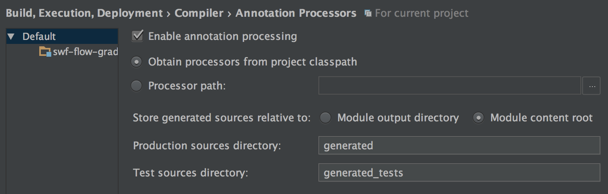

#AWS Flow Framework with Gradle and Intellij Idea
How can I get the AWS Flow Framework to work using IntelliJ Idea and Gradle?

##Gradle Configuration

Adding the SWF build tools to the Gradle build is enough to generate the code
required for basic use of your activities and workflows, but it doesn't perform
the required AspectJ weaving to make the @Asynchronous and @ExponentialRetry
annotations work in your workflow implementation.  For the required weaving
to be performed, you must tell AspectJ directly to perform the weaving.

Weaving is done at compile time, post-compile time or load time.
 * Compile Time Weaving
    This replaces the javac compiler with the ajc compiler.  If you use Lombok, 
    compile time weaving won't work because the Lombok annotations won't be handled.

 * Load Time Weaving 
    Load time weaving weaves your code at runtime. It requires you to set your java 
    agent as the aspectj weaver jar when starting your application (e.g. -javaagent:<path>/aspectjweaver-1.8.9.jar), 
    This is less than desirable if you're using SWF in a library/framework other applications will use
    as they would need to set the aspectj jar when their application starts.
    
 * Post-compile Time Weaving
    Post-compile time weaving weaves your bytecode after compilation is complete.
    No conflicts with Lombok and no special jvm args. Checkout the build.gradle file
    to see how it's done.
    
##IntelliJ Idea Configuration

###Load Time Weaving
I was unable to make post-compile weaving for the Flow Framework work inside IntelliJ, 
it became a case of diminishing returns and I had to move on. Since it's only for 
development, I decided load time weaving would suffice.  If you have gotten post-compile 
weaving to work,I'd love to hear how you did it.  I ended up committing the
aspectj weaver jar into my project and referencing it from the IntelliJ runner. Not
the most desirable method, but it got me up and going.

 * Checkin the aspectj weaver jar to a directory in your project
 * Reference that jar in the vm options of your IntelliJ runner 
 to load it as the java agent (e.g. -javaagent:./lib/aspectjweaver-1.8.9.jar)

###Enable Annotation Processing
It may be possible to teach Gradle to configure IntelliJ's annotation processing
(e.g. http://mrhaki.blogspot.com/2016/03/gradle-goodness-enable-compiler.html),
but for me it's a one-time project setup task since the configuration will be 
committed to VCS.

* Open IntelliJ settings to Build, Execution, Deployments > Compiler > Annotation Processors
* Check the box 'Enable annotation processing'
* Set 'Store generated sources relative to:' to 'Module content root'
* Set 'Production sources directory' to 'generated'
* Set 'Test sources directory' to 'generated_tests'
* Save the settings

